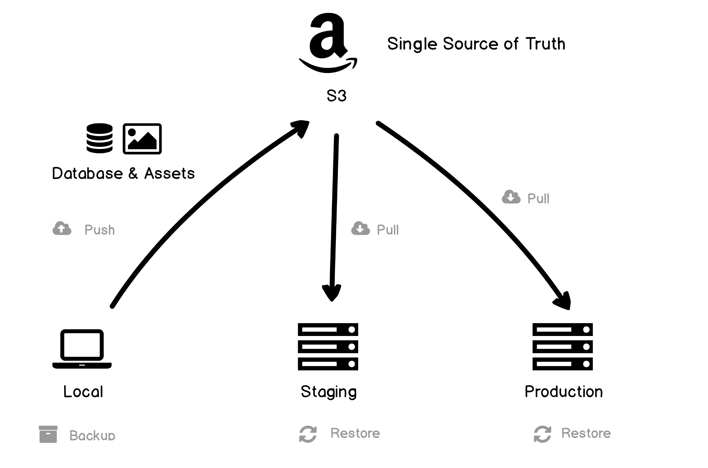

# Sync plugin for Craft CMS 3.x

Backup and restore your database and volume assets across environments from the comfort of the Craft Control Panel.


## Beta 🚨

This plugin is in beta. Please provide and feedback or suggestions to [timmy@weareferal.com](mailto:timmy@weareferal.com) (or find me on Discord, username `timmy`).

## Requirements

- Craft CMS 3 or later on Linux or MacOS (untested on Windows as of yet)
- A private AWS S3 bucket for backups

## Installation

To install the plugin, follow these instructions.

1. Open your terminal and go to your Craft project:

   ```sh
   $ cd /path/to/project
   ```

2. Then tell Composer to load the plugin:

   ```sh
   $ composer require weareferal/sync
   ```

3. In the Control Panel, go to Settings → Plugins and click the *Install* button for Craft Sync.

## Overview

Craft Sync is a plugin that makes it possible to sync your database and volume assets across numerous environments from the comfort of the Craft Control Panel. This makes it much easier to move your site from local development to staging and onto production.



This plugin uses AWS S3 (more providers to come soon) as the "single source of truth" for all site DB/volume asset backups. It provides an easy-to-configure settings page as well as an interface in Craft's "utilties" section to:

- Back up DB/volume assets locally
- Push backups to S3
- Pull backups from S3
- Restore backups

For more information read our blog post on ["Syncing your DB and assets across environments in Craft 3"](https://weareferal.com/tldr/syncing-your-db-and-assets-across-environments-in-craft-3/) or get in touch at [timmy@weareferal.com](mailto:timmy@weareferal.com)

This plugin is inspired by  who also [has a great blog post on syncing you DB and assets in Craft](https://nystudio107.com/blog/database-asset-syncing-between-environments-in-craft-cms).

## Configuring Craft Sync


Configuration is done through the dedicated "Sync" settings panel. The details entered here correspond to your AWS S3 account and bucket that you want to use for backups. It's recommended to set up a new IAM user that has programmatic access (meaning via a acces/secret key) to a private S3 bucket.

Once you have set this bucket up, you can either enter your AWS S3 details directly into the setting page, or you can use environment variables via your `.env` file (this is the recommended approach as seen in the screenshot above). This latter approach is more portable and secure as it prevents any private access/secret key values being included in files that you might commit to Github. Furthermore is means these variables can be reused in other plugins etc.

Here is an example portion of a  `.env` file:

```sh
...

AWS_ACCESS_KEY = 
AWS_SECRET_KEY = 
AWS_REGION = "us-west-2"
AWS_BUCKET_NAME = "feral-backups"
AWS_BUCKET_PREFIX = "craft-backups/my-site"
```

## Usage


Once you have entered your settings variables you should be able to use the "sync" tab on the "utilities" section of the control panel.

There are two broad sections: one for the database and one for volume assets. Each section has four options to create a local backup, push that local backup to S3, pull all remote backups _from_ S3 and finally to restore a particular backup.

## Functionality

All local backups are stored in the existing `storage/backups` folder that Craft uses for its own database backup script.

For database backups and restorations we use the existing Craft scripts - they are just included in our dashboard as an easier consolodated interface.

For volume assets backups, we simply create a versioned zip file containing the handles of all volume assets currently saved in the system. Bear in mind if you have a large number of assets this process may take some time and take up a significant amount of storage.

## Roadmap

Some things to do, and ideas for potential features:

* Add a "test details" button in the settings page to immediately test S3 connection
* Add more providers

Brought to you by [Feral](https://weareferal.com)
